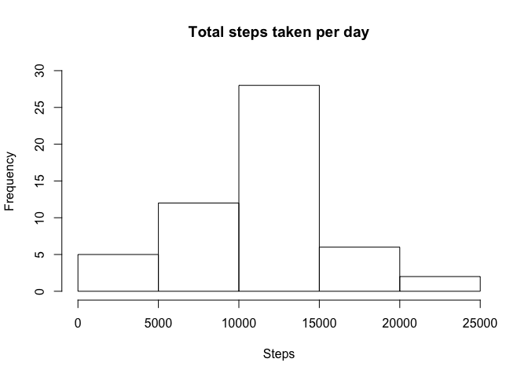
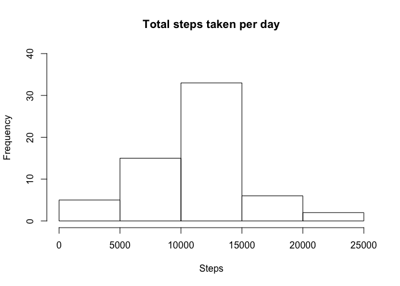
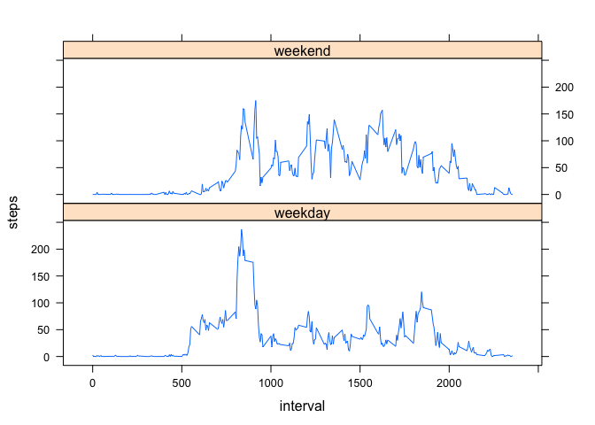

# Reproducible Research: Peer Assessment 1


## Loading and preprocessing the data

We load the data from the current folder.

```r
steps <- read.csv("activity.csv", header=TRUE)
steps$date <- as.Date(steps$date)
```

## What is mean total number of steps taken per day?

First we sum the steps across each day and plot a histogram of the number of steps per day.

```r
stepsday <- aggregate(steps$steps, list(steps$date), sum)
colnames(stepsday) <- c("day", "steps")
hist(stepsday$steps, main = "Total steps taken per day", xlab = "Steps", ylim = c(0,30))
```

<!-- -->

We then calculate the mean and median for each day.

```r
meansteps <- round(mean(stepsday$steps, na.rm = TRUE), 0)
meansteps
```

```
## [1] 10766
```

```r
mediansteps <- round(median(stepsday$steps, na.rm = TRUE), 0)
mediansteps
```

```
## [1] 10765
```

The mean of the total number of steps taken per day is 10766. The median of the total number of steps taken per day is 10765.

## What is the average daily activity pattern?

First, we make a time series plot of the average number of steps taken through the day, as averaged across all days.

```r
stepsblock <- aggregate(steps$steps, list(steps$interval), mean, na.rm = TRUE)
colnames(stepsblock) <- c("interval", "steps")
plot(stepsblock, type = "l")
```

<!-- -->

We then calculate which interval contains the maximum number of steps.

```r
intervalMax <- stepsblock[which.max(stepsblock$steps),]
intervalMax
```

```
##     interval    steps
## 104      835 206.1698
```
The interval in which the maximum number of steps occurs is 835, when 206 steps are taken.

## Imputing missing values

First we calculcate the number of rows with missing values.

```r
missing <- sum(is.na(steps$steps))
missing
```

```
## [1] 2304
```
There are 2304 rows with missing values. 

To determine our strategy for imputing missing values, we will first check the pattern of missing values across days.

```r
table(weekdays(steps$date), is.na(steps$steps))
```

```
##            
##             FALSE TRUE
##   Friday     2016  576
##   Monday     2016  576
##   Saturday   2016  288
##   Sunday     2016  288
##   Thursday   2304  288
##   Tuesday    2592    0
##   Wednesday  2304  288
```
In each case, values are missing for a full day, and the mix of days is uneven.

As a result (and anticipating later analysis comparing weekdays and weekends), we will impute values by determining the mean steps for each interval for each day, and use that to fill the missing values for those days with no entries.

First we create our imputed dataset by finding the mean across days and intervals. We then fill the missing values.

```r
# Create dataset of mean values that will be used to fill gaps
imputed <- aggregate(steps ~ weekdays(date) + interval, data = steps, FUN = mean, na.rm = TRUE)

# Create a new data.frame for complete dataset and a loop to fill missing values
stepsComplete <- steps

for (i in 1:dim(stepsComplete)[1]) {
    if (is.na(stepsComplete$steps[i])) {
        day <- weekdays(stepsComplete$date[i])
        interval <- stepsComplete$interval[i]
        stepsComplete$steps[i] <- imputed$steps[imputed$`weekdays(date)` == day & imputed$interval == interval]
    }
}
```

For this new complete dataset, we produce a histogram of the steps each day, and the new mean and median steps taken.

```r
#Calculate the average steps per day
stepsdayImputed <- aggregate(stepsComplete$steps, list(stepsComplete$date), sum)
colnames(stepsdayImputed) <- c("day", "steps")

#Produce the histogram
hist(stepsdayImputed$steps, main = "Total steps taken per day", xlab = "Steps", ylim = c(0,40))
```

<!-- -->

```r
#Calculate the mean and median
meanstepsImputed <- round(mean(stepsdayImputed$steps, na.rm = TRUE), 0)
meanstepsImputed
```

```
## [1] 10821
```

```r
medianstepsImputed <- round(median(stepsdayImputed$steps, na.rm = TRUE), 0)
medianstepsImputed
```

```
## [1] 11015
```

For the complete dataset with missing valuies imputed, the mean of the total number of steps taken per day is 10821. The median of the total number of steps taken per day is 11015.

## Are there differences in activity patterns between weekdays and weekends?

First we create a new factor to identify whether the day is a weekday or weekend, and append it in a new column to our complete dataset.

```r
# Create a new column with the day of the week
stepsComplete$we <- weekdays(stepsComplete$date)

#Develop a function to identify whether the day of the week is a weekend or weekday, and convert factors in the new column to weekday or weekend
we <- function(x) {
    if (x == "Monday" | x == "Tuesday" | x == "Wednesday" | x == "Thursday" | x == "Friday") {
        y <- "weekday"
        }
    if (x == "Saturday" | x == "Sunday") {
        y <- "weekend"
    }
    y
}

for (i in 1:dim(stepsComplete)[1]) {
    stepsComplete$we[i] <- we(stepsComplete$we[i])
}
```

We then average across weekdays and weekends to create plots of the average steps in each interval for weekdays and weekends.

```r
#Average across weedays and weekends
stepsWeekAverage <- aggregate(steps ~ interval + we, data = stepsComplete, FUN = mean)

#Plot 
library(lattice)
xyplot(steps ~ interval | we, data=stepsWeekAverage, type="l", layout = c(1, 2))
```

<!-- -->

There are differences in the patterns between weekdays and weekends. Weekdays have more steps early in the day, while weekends have a more even distribution of steps.
